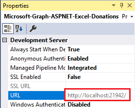
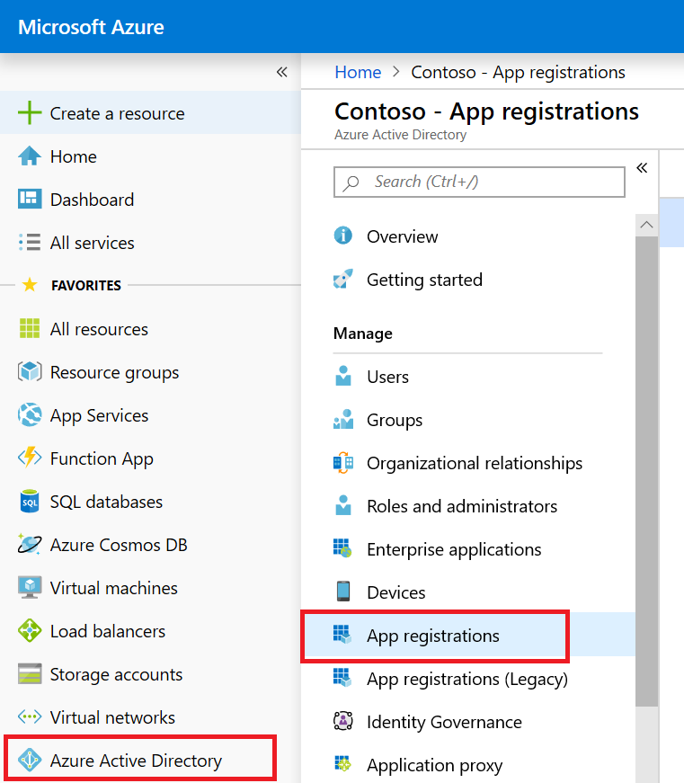
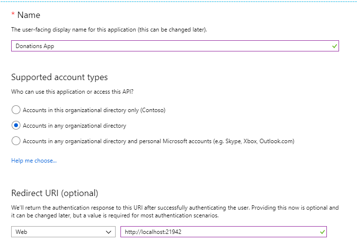
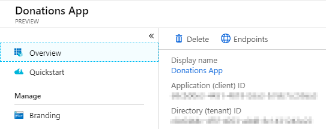

# Microsoft Graph Excel ASP.NET donations sample

This sample shows how to read and write into an Excel document stored in your OneDrive for Business account by using the Excel REST APIs.

## Prerequisites

This sample requires the following:  

  * [Visual Studio 2017](https://www.visualstudio.com/en-us/downloads) 
  * Either a [Microsoft account](https://www.outlook.com) or [work or school account](https://dev.office.com/devprogram)

## Register the application

1. Determine your ASP.NET app's URL. In Visual Studio's Solution Explorer, select the **Microsoft-Graph-ASPNET-Excel-Donations** project. In the **Properties** window, find the value of **SSL URL**. Copy this value.

    

1. Open a browser and navigate to the [Azure Active Directory admin center](https://aad.portal.azure.com). Login using a **Work or School Account**.

1. Select **Azure Active Directory** in the left-hand navigation, then select **App registrations** under **Manage**.

    

1. Select **New registration**. On the **Register an application** page, set the values as follows.

    - Set a preferred **Name** e.g. `Donations App`.
    - Set **Supported account types** to **Accounts in any organizational directory**.
    - Under **Redirect URI**, set the first drop-down to `Web` and set the value to the ASP.NET app SSL URL you copied in step 1. For this sample, *http://localhost:21942*

    

1. Choose **Register**. On the **Donations App** page, copy the value of the **Application (client) ID** and save it, you will need it in the next step.

    

1. Select **Authentication** under **Manage**. Locate the **Implicit grant** section and enable **ID tokens**. Choose **Save**.

    

    The **Allow Implicit Flow** option enables the hybrid flow. During authentication, this enables the app to receive both sign-in info (the id_token) and artifacts (in this case, an authorization code) that the app can use to obtain an access token.

1. Select **Certificates & secrets** under **Manage**. Select the **New client secret** button. Enter a value in **Description** and select one of the options for **Expires** and choose **Add**.
    
    

1. Copy the client secret value before you leave this page. You will need it in the next step.

    > [!IMPORTANT]
    > This client secret is never shown again, so make sure you copy it now.

    

## Configure the app
1. Open **Microsoft-Graph-ASPNET-Excel-Donations.sln** file. 
2. In Solution Explorer, open the **Web.config** file. 
3. Replace *ENTER_YOUR_CLIENT_ID* with the client ID of your registered Azure application.
4. Replace *ENTER_YOUR_SECRET* with the key of your registered Azure application.
5. Upload the **WoodGroveBankExpenseTrendsWorkbook.xlsx** file included in this repo to the root OneDrive directory of your Office 365 tenant. The app won't work without this workbook, which stores the data in your donations list.

## Run the app

1. Press F5 to build and debug. Run the solution and sign in with your Office 365 account. The application launches on your localhost and shows the starter page. 

     > Note: Copy and paste the start page URL address **http://localhost:21942/home/index** to a different browser if you get the following error during sign in:**AADSTS70001: Application with identifier ad533dcf-ccad-469a-abed-acd1c8cc0d7d was not found in the directory**.
2. Select the `Get Started` button.
3. The application displays the donations page. Select the `Add New` link to add a new task. Fill in the form with the donation details.
4. After you add a donation, the app shows the updated donations list. If the newly added donation isn't updated, choose the `Refresh` link after a few moments.

## Contributing ##

If you'd like to contribute to this sample, see [CONTRIBUTING.MD](/CONTRIBUTING.md).

This project has adopted the [Microsoft Open Source Code of Conduct](https://opensource.microsoft.com/codeofconduct/). For more information see the [Code of Conduct FAQ](https://opensource.microsoft.com/codeofconduct/faq/) or contact [opencode@microsoft.com](mailto:opencode@microsoft.com) with any additional questions or comments.

## Questions and comments

We'd love to get your feedback about the Microsoft Graph Excel REST API ASP.NET Donations sample. You can send your questions and suggestions to us in the [Issues](https://github.com/microsoftgraph/aspnet-donations-rest-sample/issues) section of this repository.

Questions about Office 365 development in general should be posted to [Stack Overflow](https://stackoverflow.com/questions/tagged/MicrosoftGraph). Make sure that your questions or comments are tagged with [MicrosoftGraph].
  
## Additional resources

* [Microsoft Graph documentation](https://graph.microsoft.io)
* [Other Microsoft Graph ASP.NET samples](https://github.com/MicrosoftGraph?utf8=%E2%9C%93&q=aspnet)

## Copyright
Copyright (c) 2019 Microsoft. All rights reserved.
